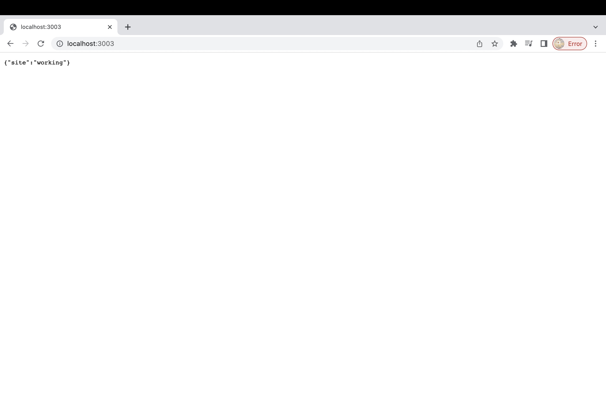

# Crypto Websocket  &  Api
<span style="color:green">Project still in development with certain features availabale for use. </span> 

---

## `Contents`
- [Overview](#overview)
- [Technologies used](#technologies-used)
- [Install](#install)
- [Notice](#notice)
- [How it works](#how-it-works)
- [Api Keys](#api-keys)
- [Services](#services)
- [Routes](#routes)
- [Connecting to Alpaca Websocket](#connecting-to-alpaca-websocket)
- [Connecting to Alpaca Api](#connecting-to-alpaca-api)
- [Response Objects](#response-objects)

## `Overview`
This api uses Alpaca's websocket and api and renders <span style="color:green">*REAL-TIME* </span> crypto prices along with 1minute, 1hour, 1month, 1week, 1day and 1month charts. Alpaca's docs can be found [here](https://alpaca.markets/docs/api-references/market-data-api/crypto-pricing-data/realtime/). The live stream works by calling its api and websocket simultaneously from the frontend, an example seen [here](https://github.com/Briskrem/ncs-crypto-front/blob/main/src/Crypto.js).\
The charts data are made with a separate api call to Alpacas's api.

---
## `Technologies used`
    Node js, Express, Alpaca api, socket.io, ws

---

## `Install`
1. Clone repository.
2. npm i.
3. nodemon server.js.
4. Enter http://localhost:3003  in url.



---

## `Notice`
- In cryptoModel.js, in getTicker method, setTimeout closes the websocket connection after 10 seconds deliberately as project is still in development. This can be adjusted.

---


## `How it works`
<span style="color:green">2 WEBSOCKETS ARE USED. </span>\
The frontend calls the api and its websocket at the same time. **The api call** runs the websocket function(turns it on) and it's now able to answer the **websocket call**, the frontend is now connected to the websocket in the api. This connection is established using `socket.io`.\
When `socket.io` connects, the eventlisteners run and make a second websocket request using `ws`, this request now connects to the Alpaca websocket to receive the stream.\
`ws` websocket streams the data directly from Alpaca into the api's own `socket.io` websocket which then streams that to the frontend.

---

## `Api Keys`
To use this package you first need to obtain an API key. Go [here](https://app.alpaca.markets/signup) to sign up.

---

## `Services`
- Crypto *REAL-TIME price* data stream.
- Crypto charts.

---

## `Routes`

```javascript
- '/ticker/:cryptoID' - websocket gets live crypto data.
```
```javascript
- '/stats/:cryptoID' - gets crypto charts
```

---

## `Connecting to Alpaca websocket`

```javascript
- Websocket base url
 'wss://stream.data.sandbox.alpaca.markets/v1beta2/crypto'
```

```javascript
- Authentication
{
    "action": "auth", 
    "key": "{APCA-API-KEY-ID}", 
    "secret": "{APCA-API-SECRET-KEY}"
}

```

```javascript
- Subscription
{
    "action":"subscribe",
    "trades":["BTC/USD"],
    "quotes":["LTC/USD", "ETH/USD"],
    "bars":["BCH/USD"]
}

```
---
## `Connecting to Alpaca api`

```javascript
API base url

- https://data.alpaca.markets/v1beta2/crypto
```
```javascript
API endpoint

- /v1beta2/crypto/bars
```


```javascript
- Authentication
  APCA-API-KEY-ID
  APCA-API-SECRET-KEY
```

---

## `Response Objects`
-  **Crypto Price stream response object**
``` javascript

[
    {
        "T":"b",
        "S":"BTC/USD",
        "o":47993.71,
        "c":47982.6,
        "h":48000,
        "l":47976.69,
        "v":1.66283276,
        "t":"2021-09-17T02:02:00Z",
        "n":162,
        "vw":47984.1688165374
    }
]

```
- **Crypto bar response object**

``` javascript
 "bars": {

    "BTC/USD": {
      "c": 19763,
      "h": 19769,
      "l": 19757,
      "n": 6,
      "o": 19762,
      "t": "2022-07-13T18:25:00Z",
      "v": 0.027,
      "vw": 19758.6259259259
    }

}

```


